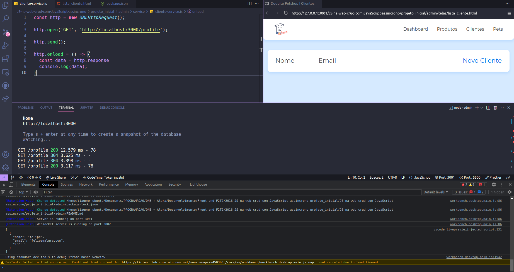

abrir a pasta admin no vscode e 
rodar o json server: 
```js
json-server --watch db.json
```
___________________________

Rodar: browser-sync start --server --file . --host --port 5000 --startPath admin/telas/lista_cliente.html

#  JS na web: crud com JavaScript assíncrono

**Instrutor:** Felipe Nascimento 

Faça esse curso de JavaScript e:

- Crie um CRUD utilizando o método fetch e os verbos HTTP

- Aprenda a consumir dados de uma API e exibir no seu front-end

- Entenda como utilizar o método fetch para consumir dados de uma API

- Manipule os verbos HTTP através do método fetch

- Aprenda como funcionam as promises no JavaScript

____________________________

### Comunicação assíncrona
 
 **Tela de Clientes**

 

 **Exibindo dados**

 