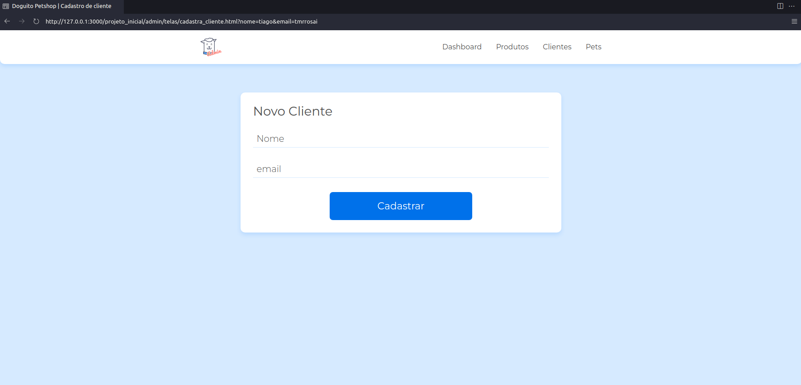
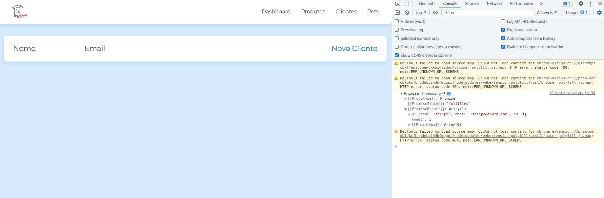
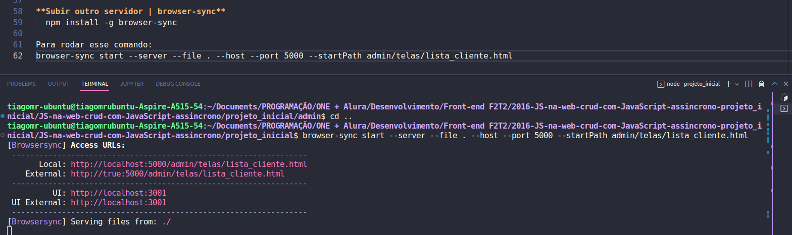
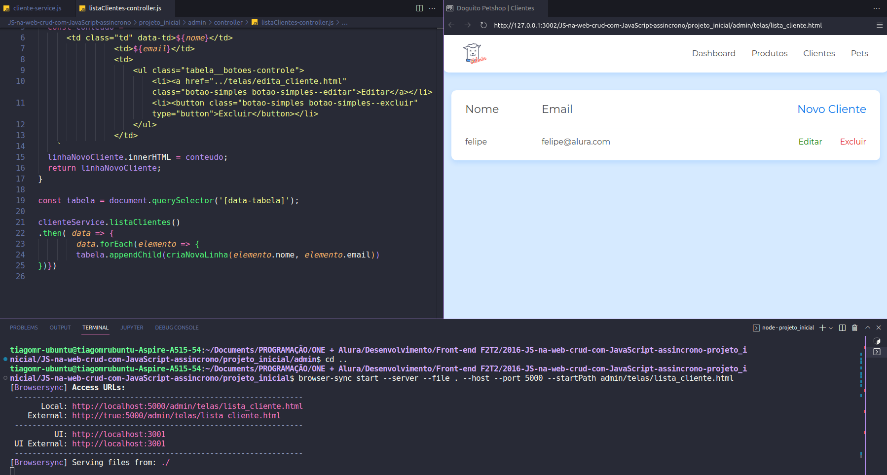
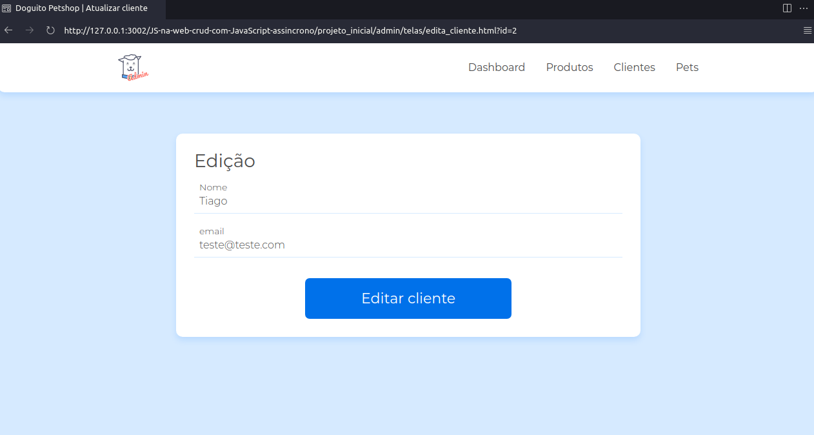
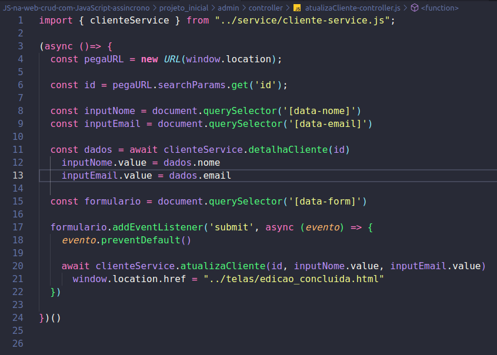
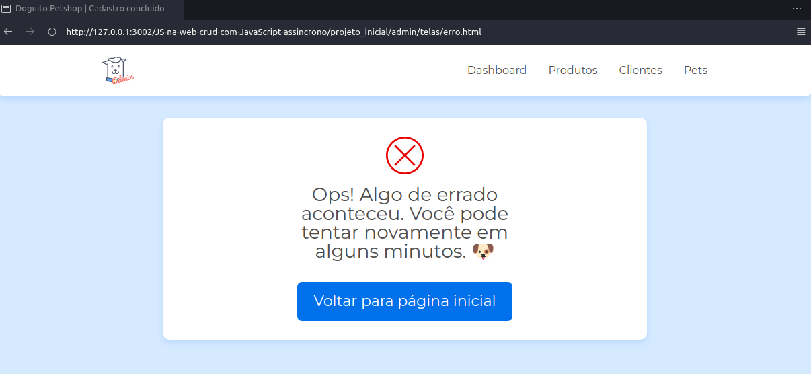
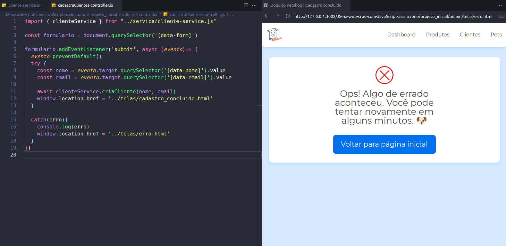

abrir a pasta admin no vscode e 
rodar o json server: 
```js
json-server --watch db.json
```
___________________________

Rodar: browser-sync start --server --file . --host --port 5000 --startPath admin/telas/lista_cliente.html

#  JS na web: crud com JavaScript assíncrono

**Instrutor:** Felipe Nascimento 

Faça esse curso de JavaScript e:

- Crie um CRUD utilizando o método fetch e os verbos HTTP

- Aprenda a consumir dados de uma API e exibir no seu front-end

- Entenda como utilizar o método fetch para consumir dados de uma API

- Manipule os verbos HTTP através do método fetch

- Aprenda como funcionam as promises no JavaScript

____________________________

### Comunicação assíncrona
 
 **Tela de Clientes**

 

 **Exibindo dados**

 

 **Lidando com promises**



**O que aprendemos?**

Nesta aula, aprendemos:

- Fazer requisições utilizando XMLHttpRequest.

- Lidar com promises.

- Fazer uma requisição http utilizando XMLHttpRequest para buscar todos os clientes do servidor.

- Refatorar o código utilizando promises melhorando a leitura do código.

- Utilizar template literals para criar um template html.

### 02. Fetch API

#### Refatorando responsabilidades

**Subir outro servidor | browser-sync** 

[Time-saving synchronised browser testing](https://browsersync.io/)

  npm install -g browser-sync

Para rodar esse comando: 
browser-sync start --server --file . --host --port 5000 --startPath admin/telas/lista_cliente.html 

**localhost:5000**


_________



**VsCode | Live server | Terminal | Browser sync** 



#### Event Loop

**Visualizing the javascript runtime at runtime**

[Latent flip](http://latentflip.com/loupe/?code=JC5vbignYnV0dG9uJywgJ2NsaWNrJywgZnVuY3Rpb24gb25DbGljaygpIHsKICAgIHNldFRpbWVvdXQoZnVuY3Rpb24gdGltZXIoKSB7CiAgICAgICAgY29uc29sZS5sb2coJ1lvdSBjbGlja2VkIHRoZSBidXR0b24hJyk7ICAgIAogICAgfSwgMjAwMCk7Cn0pOwoKY29uc29sZS5sb2coIkhpISIpOwoKc2V0VGltZW91dChmdW5jdGlvbiB0aW1lb3V0KCkgewogICAgY29uc29sZS5sb2coIkNsaWNrIHRoZSBidXR0b24hIik7Cn0sIDUwMDApOwoKY29uc29sZS5sb2coIldlbGNvbWUgdG8gbG91cGUuIik7!!!PGJ1dHRvbj5DbGljayBtZSE8L2J1dHRvbj4%3D)

**Nesta aula, aprendemos:**

- Entender a ordem de execução do código JavaScript.

- Puxar dados do servidor utilizando a função a **fetch api** ao invés do **xmlhttprequest** para modernizar o código.

- Refatorar as responsabilidades do código pensando na manutenção da aplicação no futuro.

### 03. Criar e remover clientes

**Criando um cliente**


**Nesta aula, aprendemos:**

- Usar a método **closest** para encontrar o elemento do **DOM** mais próximo ao que queremos remover

- Criar um cliente utilizando o verbo http **POST**.

- Remover um elemento do dom com método **remove()**

- Deletar um cliente utilizando o verbo http **DELETE**

### 04. Editar dados

**Edita cliente**



Nesta aula, aprendemos:

- Fazer uma query string utilizando a propriedade **searchParams.get()** para encontrar um id.

- Criar uma IIFE ou função auto executável.

- Editar os dados utilizando o verbo http **PUT**.

### 05. Async/Await  

**Funções assíncronas**
 
[Funções assíncronas | MDN](https://developer.mozilla.org/pt-BR/docs/Web/JavaScript/Reference/Statements/async_function)


**Async/Await | arquivo: Atualiza Cliente**



**Lidando com Erros**



**Código com Try/Catch e Live Server com a página de erro**



**Nesta aula, aprendemos:**

- Utilizar async/await para indicar funções assíncronas.

- Tratar erros com try/catch